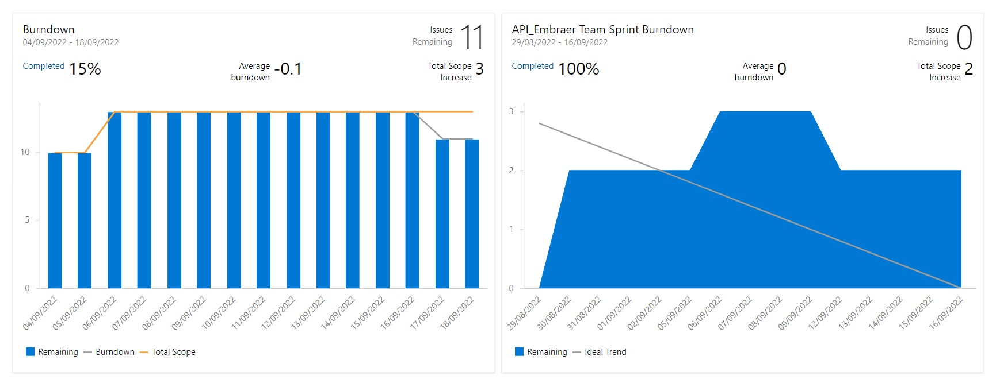

  <h1>Sprint 1 - Inicio: 29/08/2022 | Entrega: 18/09/2022</h1>

  
  
#### Navegador
* <a href="#objetivo">Objetivo da Sprint</a>
* <a href="#requisitos">Levantamento de requisitos</a>
* <a href="#bd">Banco de dados</a>
* <a href="#type">Aplicação</a>
* <a href="#burndown">Burndown</a>

# 📌 Objetivo da Sprint 
  

Nessa primeira sprint a equipe foi divida a fim de organizar e definir as prioridades do cliente, chegando, assim, à ideia do MVP (<i>Minimum Viable Product</i>). O projeto como um todo é orientado pela metodologia ágil (<i>Scrum</i>), cujo conteito principal é a ideia de finalizar um projeto mais rápido, com melhor qualidade, otimizando os recursos humanos e materiais.

Para a primeira sprint, os objetivos da equipe foram divididos da seguinte forma:
  
* Validação dos requisitos, dos protótipos e das sprints;
  
* Estruturação do banco de dados;
  
* Criação do formulário de cálculo da distância de pouso, no qual o piloto da aeronave lançará as especificações da aeronave e as condições externas que influenciam nesse cálculo;
  
* Desenvolvimento da lógica que retornará o resultado do cálculo da distância de pouso da aeronave.
  

→ [Voltar ao topo](#topo)

# 📝Levantamento de Requisitos 
  

Para dar início ao projeto, os integrantes da equipe precisaram definir quais os objetivos e necessidades atuais do cliente. Após a realização do kick-off, os objetivos e necessidades identificados pelo grupo foram informados para o cliente via Slack para confirmação das informações. Pelo mesmo canal foram trocadas informações com o intuito de refinar a proposta do projeto e a partir daí, a equipe foi capaz de montar uma rota estratégica com a definição do MVP e com a programação das quatro sprints, devidamente validadas pelo cliente.

  
→ [Voltar ao topo](#topo)
  

# 🗃 Banco de dados
  

Inicialmente foram definidas as informações que o sistema deveria registrar acerca das aeronaves e condições de pista e clima que são determinantes para o resultado do cálculo. Com isso, foi criado o Diagrama Entidade-Relacionamento para orientar o funcionamento do banco de dados da aplicação: 
 

→ [Voltar ao topo](#topo) 
 

# 🖥 Aplicação
  

Com as informações iniciais bem definidas e a devida aprovação dos protótipos, foi validado como entrega da primeira sprint o formulário de cálculo e a lógica desse cálculo. Assim, a equipe iniciou o desenvolvimento da aplicação com a parte do front-end, utilizando as ferramentas HTML, CSS e JavaScript. Paralelamente a isso, a equipe estruturou o banco de dados a partir do My SQL. Esse banco de dados será incorporado à aplicação a partir da segunda sprint. Por fim, foi elaborada a estrutura lógica do cálculo, na linguagem TypeScript, que foi conectada ao front-end.

  

https://user-images.githubusercontent.com/86115352/190877717-99d6b5cd-bbb0-4e68-85b2-71bdbaa922b1.mp4

→ [Voltar ao topo](#topo)

  
# 📉 Burndown
  

O gráfico de Burndown é um método usado para acompanhar o andamento da sprint muito comum nas metodologias ágeis. Ele possui a vantagem de permitir a rápida visualização do progresso das atividades por todo o time de desenvolvimento, sem necessariamente entrar nas histórias de usuário. 
 
Neste gráfico de Burndown foi retratada a divisão da equipe em três times: um responsável pela estruturação do banco de dados, outro responsável pelo desenvolvimento do front-end (parte visual da aplicação) e o terceiro responsável pelo back-end (parte lógica da aplicação). 
 
Foram necessárias muitas pesquisas e estudos para a realização das tarefas, considerando que houve ruído na comunicação com o cliente e que foram empregadas tecnologias novas. 

→ [Voltar ao topo](#topo)

> Equipe Tech Drivers, 2022  
> 🖱️ [Github](https://github.com/TechDriversFatec) 
> 📧 [E-mail](mailto:techdrivers.fatec@gmail.com)

