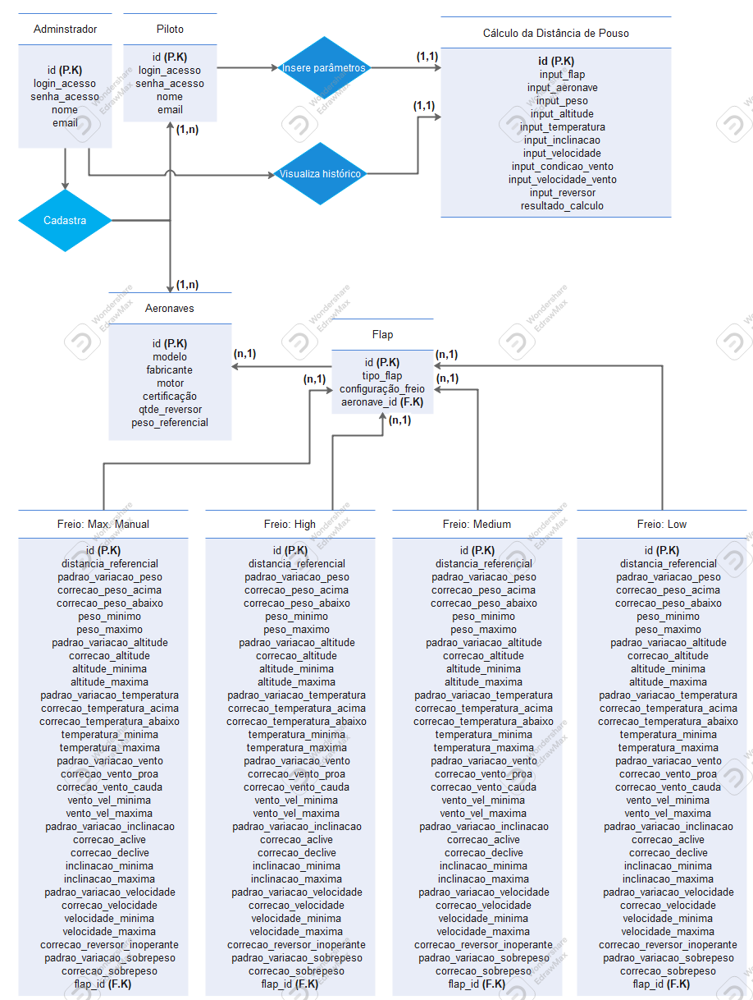
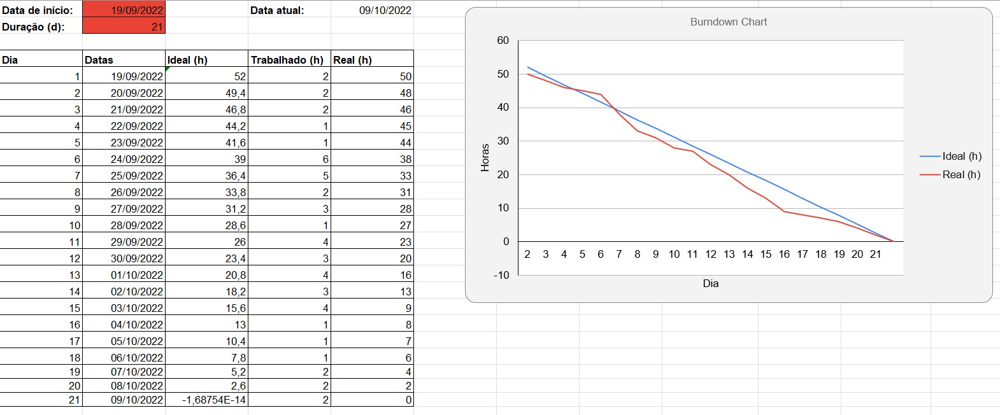
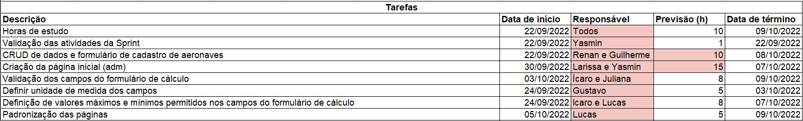

  <h1>Sprint 2 - Inicio: 19/09/2022 | Entrega: 09/10/2022</h1>

  

#### Navegador
* <a href="#objetivo">Objetivo da Sprint</a>
* <a href="#requisitos">Levantamento de requisitos</a>
* <a href="#bd">Banco de dados</a>
* <a href="#type">Aplicação</a>
* <a href="#burndown">Burndown</a>

# 📌 Objetivo da Sprint 
  

Na segunda sprint a equipe partiu do feedback recebido na primeira entrega para reorganizar as prioridades, definindo com o cliente as prioridades para esta etapa. Nessa oportunidade, a equipe aproveitou para rever alguns alinhamentos internos para poder dar sequência da melhor forma possível.

Para a segunda sprint, os objetivos da equipe foram divididos da seguinte forma:
  
* Validação das atividades da sprint;
  
* CRUD de dados da aeronave;
  
* Desenvolvimento da tela inicial (perfil administrativo) e do filtro que auxiliará na seleção das informações;
  
* Definição de valores máximos e mínimos nos campos do formulário de cálculo;

* Definição das unidades de medidas dos campos (Internacional/Imperial);

* Validação dos campos do formulário de cálculo;

* Adaptação do design das telas.
  

→ [Voltar ao topo](#topo)

# 📝Levantamento de Requisitos 
  

Para dar continuidade ao projeto, os integrantes da equipe analisaram e optaram por implementar as sugestões dadas no feedback da primeira sprint. Com essas sugestões, foi possível traçar um planejamento para replanejar e revalidar a entrega da segunda sprint.

  
→ [Voltar ao topo](#topo)
  

# 🗃 Banco de dados
  

As informações inicialmente definidas foram revisadas e isso resultou na alteração da estrutura do banco de dados previsto na sprint anterior. A seguir, é apresentado o Diagrama Entidade-Relacionamento com as informações relativas às aeronaves e às condições de pista e clima determinantes para o resultado do cálculo. Esse diagrama foi a base para o CRUD realizado: 
 

→ [Voltar ao topo](#topo) 
 

# 🖥 Aplicação
  

A partir do feedback colhido na primeira sprint, foi validado como entrega da segunda sprint as alterações nos campos do formulário de cálculo, a criação da tela inicial com filtro, o CRUD dos dados, a adaptação do design das telas e a definição de validadores para os campos do formulário de cálculo. Assim, a equipe deu contuidade ao desenvolvimento da aplicação integrando o front-end e o back-end por meio da biblioteca React. Paralelamente a isso, a equipe iniciou o CRUD a partir do My SQL, e esse banco de dados já está integrado à aplicação.
 

  
### Cadastro de aeronave

Para acessar o vídeo que demonstra a etapa de cadastro da aeronave dentro da aplicação basta clicar [aqui](https://clipchamp.com/watch/liuBpFZVpDh).

  
### Cálculo 

https://user-images.githubusercontent.com/86115352/194782032-98fa8850-1ed7-4985-af56-7fc29e84ea74.mp4

→ [Voltar ao topo](#topo)

  
# 📉 Burndown
  

O gráfico de Burndown é um método usado para acompanhar o andamento da sprint muito comum nas metodologias ágeis. Ele possui a vantagem de permitir a rápida visualização do progresso das atividades por todo o time de desenvolvimento, sem necessariamente entrar nas histórias de usuário. 
 
Neste gráfico de Burndown foi retratado o tempo empregado no desenvolvimento das atividades propostas e validadas junto ao cliente, bem como o tempo dedicado às pesquisas e estudos necessários para a realização das tarefas. 

 

 
 

→ [Voltar ao topo](#topo)
