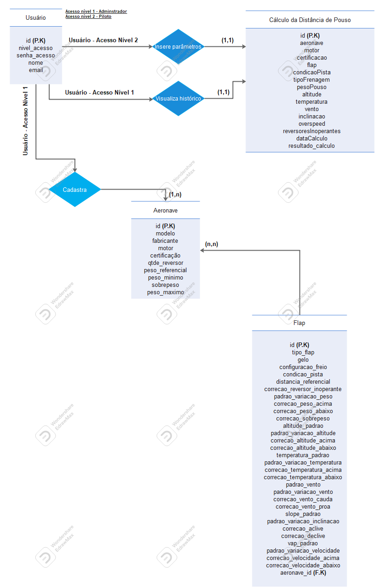
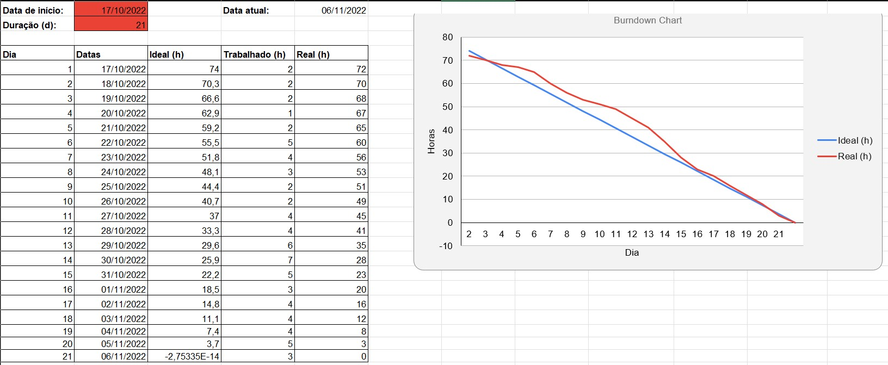
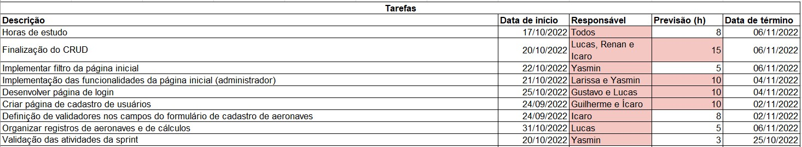

  <h1>Sprint 3 - Inicio: 17/10/2022 | Entrega: 06/11/2022</h1>

  

#### Navegador
* <a href="#objetivo">Objetivo da Sprint</a>
* <a href="#requisitos">Levantamento de requisitos</a>
* <a href="#bd">Banco de dados</a>
* <a href="#type">Aplicação</a>
* <a href="#burndown">Burndown</a>

# 📌 Objetivo da Sprint 
  

Na terceira sprint a equipe partiu do feedback recebido na segunda entrega para reorganizar as prioridades, definindo com o cliente quais seriam as prioridades para a entrega que estava por vir. Nessa oportunidade, a equipe aproveitou para rever alguns alinhamentos internos e, assim, dar sequência da melhor forma possível.

Para a terceira sprint, os objetivos da equipe foram divididos da seguinte forma:
  
* Validação das atividades da sprint;
  
* Finalização do CRUD de dados da aeronave;
  
* Finalização da tela inicial (perfil administrativo) com os ícones que auxiliarão na seleção das ações de inclusão, edição, leitura e exclusão de dados;
  
* Definição de validadores nos campos do formulário de cálculo;

* Criação da tela de cadastro de usuários;

* Organização das informações das aeronaves e registros dos cálculos;

* Adaptação do design das telas.
  

→ [Voltar ao topo](#topo)

# 📝Levantamento de Requisitos 
  

Para dar continuidade ao projeto, os integrantes da equipe analisaram e optaram por implementar as sugestões dadas no feedback da segunda sprint. Com essas sugestões, foi traçado um planejamento devidamente validado com o cliente para a entrega da terceira sprint.

  
→ [Voltar ao topo](#topo)
  

# 🗃 Banco de dados
  

As informações inicialmente definidas foram revisadas e isso resultou na alteração das estruturas do banco de dados previstas nas sprints anteriores. A seguir, é apresentado o Diagrama Entidade-Relacionamento com as informações relativas às aeronaves e às condições de pista e clima determinantes para o resultado do cálculo. Esse diagrama foi a base para o CRUD realizado: 
 

→ [Voltar ao topo](#topo) 
 

# 🖥 Aplicação
  

A partir do feedback recebido nas duas primeiras sprints, validamos como entrega da terceira sprint as validações nos campos do formulário de cálculo, a criação da tela de cadastro de usuários, a finalização do CRUD dos dados das aeronaves, a adaptação do design das telas e a finalização da tela inicial (perfil administrativo) com os ícones que auxiliarão na seleção das ações de inclusão, edição, leitura e exclusão de dados. Assim, a equipe deu contuidade ao desenvolvimento da aplicação integrando o front-end e o back-end por meio da biblioteca React. Paralelamente a isso, o CRUD foi realizado com o My SQL, e esse banco de dados já está integrado à aplicação.
 

### Login do administrador e cadastro de usuários
  

https://user-images.githubusercontent.com/86115352/200194684-d46a5839-ab05-43f6-884e-a2aa7bcb6868.mp4

  
  
### Cadastro de aeronaves

https://user-images.githubusercontent.com/86115352/200194699-e742fe05-b88b-48fa-b0a9-a1ce93c2573c.mp4

## Cadastro de variáveis

  
Para visualizar a demonstração, clique [aqui](https://clipchamp.com/watch/go3hNmUcdKu).

  
## Login do piloto e cálculo 

  
Para visualizar a demonstração, clique [aqui](https://clipchamp.com/watch/TeCwyL1M3AN).

→ [Voltar ao topo](#topo)

  
# 📉 Burndown
  

O gráfico de Burndown é um método usado para acompanhar o andamento da sprint muito comum nas metodologias ágeis. Ele possui a vantagem de permitir a rápida visualização do progresso das atividades por todo o time de desenvolvimento, sem necessariamente entrar nas histórias de usuário. 
 
Neste gráfico de Burndown foi retratado o tempo empregado no desenvolvimento das atividades propostas e validadas junto ao cliente, bem como o tempo dedicado às pesquisas e estudos necessários para a realização das tarefas. 

 

 
 

→ [Voltar ao topo](#topo)

> Equipe Tech Drivers, 2022  
> 🖱️ [Github](https://github.com/TechDriversFatec) 
> 📧 [E-mail](mailto:techdrivers.fatec@gmail.com)

