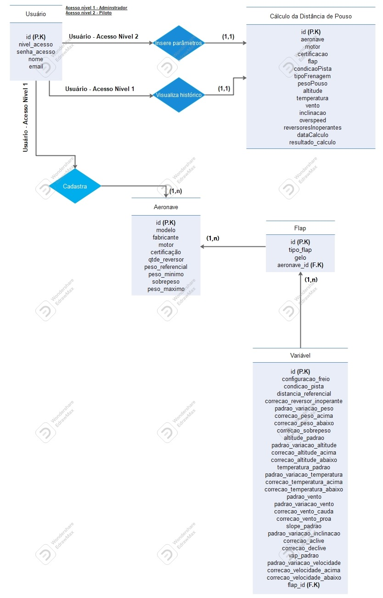

  <h1>Sprint 4 - Inicio: 07/11/2022 | Entrega: 27/11/2022</h1>

  

#### Navegador
* <a href="#objetivo">Objetivo da Sprint</a>
* <a href="#requisitos">Levantamento de requisitos</a>
* <a href="#bd">Banco de dados</a>
* <a href="#type">Aplicação</a>
* <a href="#burndown">Burndown</a>

# 📌 Objetivo da Sprint 
  

Na última sprint os esforços da equipe se concentraram no aprimoramento da interface web para cálculo de distância de pouso e em refinamentos de detalhes da aplicação, permitindo assim que o sistema fosse agradável e intuitivo e, ao mesmo tempo, atendesse aos desejos do usuário da melhor forma imaginada pelo time.

Para a última sprint, os objetivos da equipe foram divididos da seguinte forma:
  
* Validação das atividades da sprint;
  
* Implementação do Dashboard;
  
* CRUD de dados dos usuários;
  
* Aprimoramento da aplicação;

* Documentação.
  

→ [Voltar ao topo](#topo)

# 📝Levantamento de Requisitos 
  

Para a conclusão do projeto, os integrantes da equipe analisaram e optaram por implementar as sugestões dadas no feedback da terceira sprint. Com essas sugestões, foi traçado um planejamento devidamente validado com o cliente para a entrega da aplicação.

  
→ [Voltar ao topo](#topo)
  

# 🗃 Banco de dados
  

Colocar a descrição do banco de dados 
 

  # 🖥 Aplicação
  

A partir do feedback recebido nas três sprints anteriores, validamos como entrega da quarta sprint a realização do dashboard( com as informações referentes a cálculos e aeronaves), CRUD de usuários, implementação do processo de recuperar senha, implementação dos logs, finalização do update de variaveis das aeronaves, revisão dos cálculos e validadors e a realização da documentação  da aplicação.Assim, a equipe deu contuidade ao desenvolvimento da aplicação integrando o front-end e o back-end por meio da biblioteca React. Paralelamente a isso, o CRUD foi realizado com o My SQL, e esse banco de dados já está integrado à aplicação. 
 

→ [Voltar ao topo](#topo)
