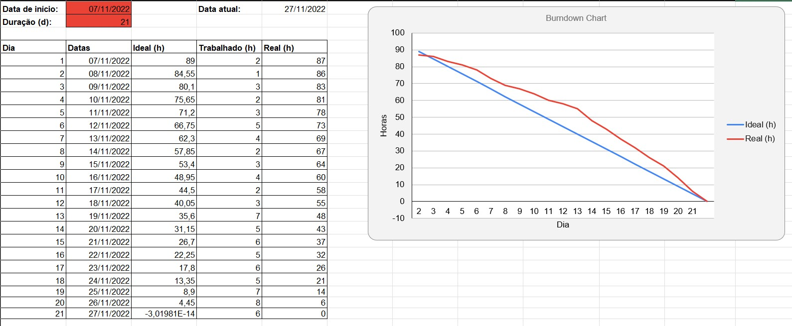
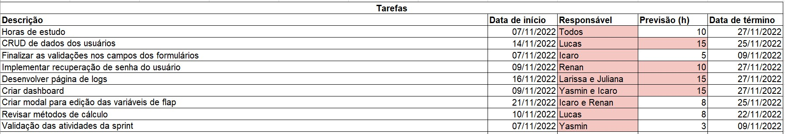

  <h1>Sprint 4 - Inicio: 07/11/2022 | Entrega: 27/11/2022</h1>

  

#### Navegador
* <a href="#objetivo">Objetivo da Sprint</a>
* <a href="#requisitos">Levantamento de requisitos</a>
* <a href="#bd">Banco de dados</a>
* <a href="#type">Aplicação</a>
* <a href="#doc">Documentação</a>
* <a href="#burndown">Burndown</a>

# 📌 Objetivo da Sprint 
  

Na última sprint os esforços da equipe se concentraram no aprimoramento da interface web para cálculo de distância de pouso e em refinamentos de detalhes da aplicação, permitindo assim que o sistema fosse agradável e intuitivo e, ao mesmo tempo, atendesse aos desejos do usuário da melhor forma imaginada pelo time.

Para a última sprint, os objetivos da equipe foram divididos da seguinte forma:
  
* Validação das atividades da sprint;
  
* Implementação do Dashboard;
  
* CRUD de dados dos usuários;
  
* Aprimoramento da aplicação;

* Documentação.
  

→ [Voltar ao topo](#topo)

# 📝Levantamento de Requisitos 
  

Para a conclusão do projeto, os integrantes da equipe analisaram e optaram por implementar as sugestões dadas no feedback da terceira sprint. Com essas sugestões, foi traçado um planejamento devidamente validado com o cliente para a entrega final da aplicação.

  
→ [Voltar ao topo](#topo)
  

# 🗃 Banco de dados
  

Após uma revisão global dos feedbacks e do funcionamento da aplicação, a equipe alterou as estruturas do banco de dados previstas nas sprints anteriores. A seguir, é apresentado o Diagrama Entidade-Relacionamento com as informações relativas às aeronaves, aos flaps e às condições de pista e clima determinantes para o resultado do cálculo. 
 

→ [Voltar ao topo](#topo)

  # 🖥 Aplicação
  

A partir do feedback recebido nas três sprints anteriores, validamos como entrega da quarta sprint a realização do dashboard( com as informações referentes a cálculos e aeronaves), CRUD de usuários, implementação do processo de recuperar senha, implementação dos logs, finalização do update de variaveis das aeronaves, revisão dos cálculos e validadors e a realização da documentação  da aplicação.Assim, a equipe deu contuidade ao desenvolvimento da aplicação integrando o front-end e o back-end por meio da biblioteca React. Paralelamente a isso, o CRUD foi realizado com o My SQL, e esse banco de dados já está integrado à aplicação. 
 

https://user-images.githubusercontent.com/86115352/204178468-670df896-4009-41de-a2fe-a0d3a3cb383d.mp4

https://user-images.githubusercontent.com/86115352/204177913-5033556b-7b08-47f0-acac-18038db1372f.mp4

https://user-images.githubusercontent.com/86115352/204177931-23b07690-32ee-4099-aea5-5fc7fa1c2f3c.mp4

https://user-images.githubusercontent.com/86115352/204177951-a1793c40-2065-441c-82cd-e3fe6ace666a.mp4

https://user-images.githubusercontent.com/86115352/204177964-65c7e425-47ff-4570-b5df-8438089cb769.mp4

→ [Voltar ao topo](#topo)
  
  

  
# 📃 Documentação
  
  
Com a entrega final do projeto, a equipe elaborou uma documentação didática que, além de contextualizar a aplicação, também detalha o passo a passo necessário para a utilização de cada um dos recursos por ela oferecidos. 

  
Para acessá-la, basta clicar [aqui](https://github.com/TechDriversFatec/API_Embraer/tree/main/Planejamento/Sprint-4/Documenta%C3%A7%C3%A3o).
  
→ [Voltar ao topo](#topo)
  

  
# 📉 Burndown
  

O gráfico de Burndown é um método usado para acompanhar o andamento da sprint muito comum nas metodologias ágeis. Ele possui a vantagem de permitir a rápida visualização do progresso das atividades por todo o time de desenvolvimento, agregando maior eficiência à execução das tarefas. 
 
Neste gráfico de Burndown foi retratado o tempo empregado no desenvolvimento das atividades propostas e validadas junto ao cliente, bem como o tempo dedicado às pesquisas e estudos necessários para a realização das tarefas. 

 

 
 

→ [Voltar ao topo](#topo)

> Equipe Tech Drivers, 2022  
> 🖱️ [Github](https://github.com/TechDriversFatec) 
> 📧 [E-mail](mailto:techdrivers.fatec@gmail.com)
