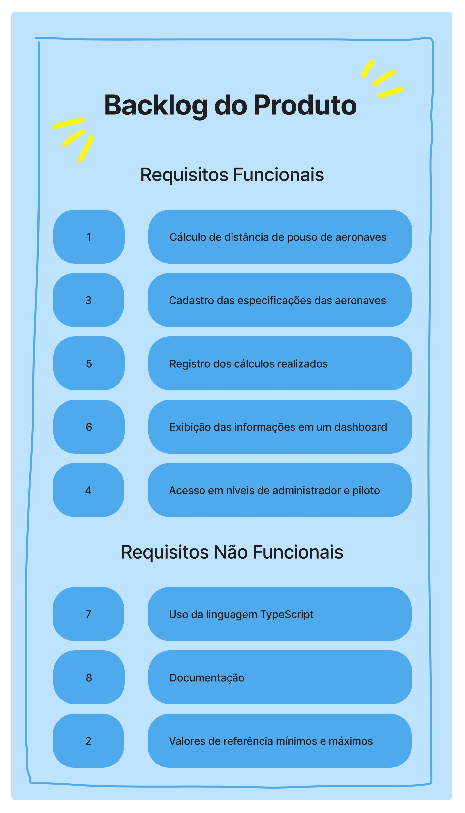
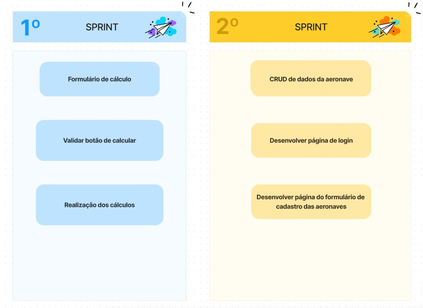
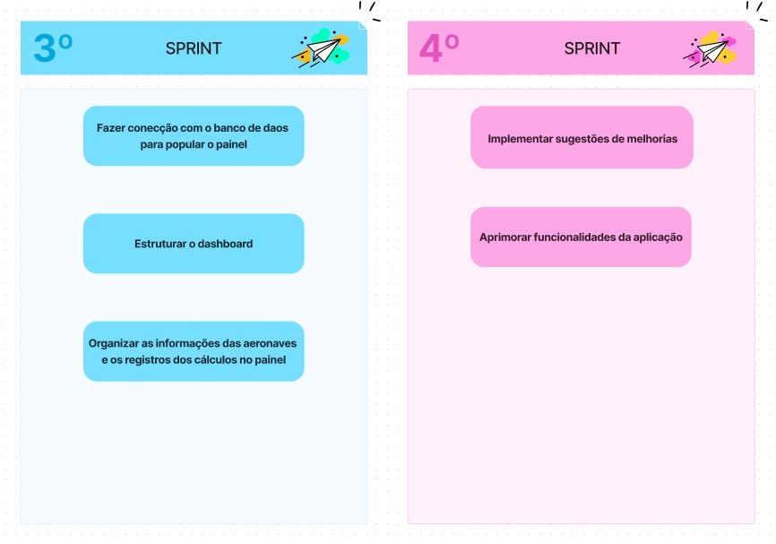
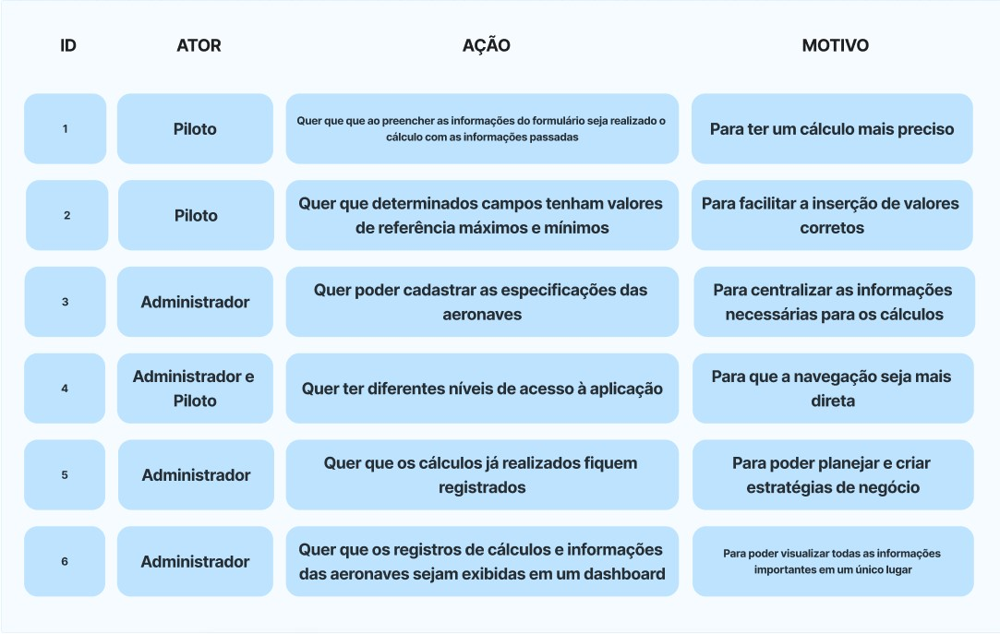

 

<h1 align="center">TechDrivers - FATEC São José dos Campos - Prof. Jessen Vidal</h1>

### Índice
* <a href="#sobre">Sobre</a> 
* <a href="#backlogs">Backlogs</a> 
* <a href="#user">User Stories</a> 
* <a href="#tecnologias">Tecnologias</a> 
* <a href="#equipe">Equipe</a> 

## 🚀 Sobre o Projeto
  > **Status do projeto: Em andamento**
  
  
O projeto visa o desenvolvimento de uma aplicação (compatível com tablet) voltada para o cálculo de distância de pouso de aeronaves. Essa aplicação foi pensada para auxiliar o piloto da aeronave, proporcionando maior agilidade e eficiência no referido cálculo.

  
  
Para mais informações sobre cada Sprint do projeto, clique nos relatórios a seguir:

  
| Sprint | Entrega	| Status | Histórico |
| :-----: | :-----: | :-----: | :-----: |
| 01 | 18/09/2022 | Em andamento | [Ver Relatório](https://github.com/TechDriversFatec/API_Embraer/tree/main/Planejamento/Sprint-1) |
| 02 | 09/10/2022 | Pendente | [Em breve] |
| 03 | 06/11/2022 | Pendente | [Em breve] |
| 04 | 27/11/2022 | Pendente | [Em breve] |
  
  → [Voltar ao topo](#topo)
  
  

## 📊 Backlogs

  ### Backlog do Produto
  
   
  

  
  

  
  ### Backlog das Sprints
  
   
  

  
    
  
  

 → [Voltar ao topo](#topo)
 
 
 
 ## 📑User Stories
 
 

 
 

 
 
 → [Voltar ao topo](#topo)
 
 
  
## :hammer_and_wrench: Protótipo

Para melhor visualização do protótipo, acesse o [link](https://www.figma.com/file/6MmeAxdkoSCF5IlgTrsgbe/API---EMBRAER?node-id=1%3A4).

 → [Voltar ao topo](#topo)
 
 
  
## 💻 Tecnologias
  
  
Para a troca de informações, validação, prototipagem e criação do projeto foram utilizadas as seguintes ferramentas:
 

  

   Slack    
   GitHub
   DevOps
   Figma
   Visual Studio Code
   
   
   TypeScript 
   HTML 5
   JavaScript
   Bootstrap
   MySQL
  

  
  → [Voltar ao topo](#topo)
  

  
## 👩‍💻 Equipe
  
|    Função    |              Nome              |                     GitHub                      |                          LinkedIn                               |
| :----------: | :----------------------------- | :----------------------------------------------:| :--------------------------------------------------------------:|
| Product Owner| Yasmin Aparecida Vieira         |        | |
| Scrum Master | Larissa Aparecida Diniz Silva   |          |       |
|   Dev Team   | Guilherme Konflanz Mezzomo      |   |  |
|   Dev Team   | Gustavo Konflanz Mezzomo        |      |  |
|   Dev Team   | Icaro Dell Osso Vaz de Carvalho |             |         |
|   Dev Team   | Juliana Gomes da Silva          |           |     |
|   Dev Team   | Lucas Nunes Duarte do Nascimento|            |  |
|   Dev Team   | Renan Vitor Fernandes Mendonça  |          |             |

 → [Voltar ao topo](#topo)
